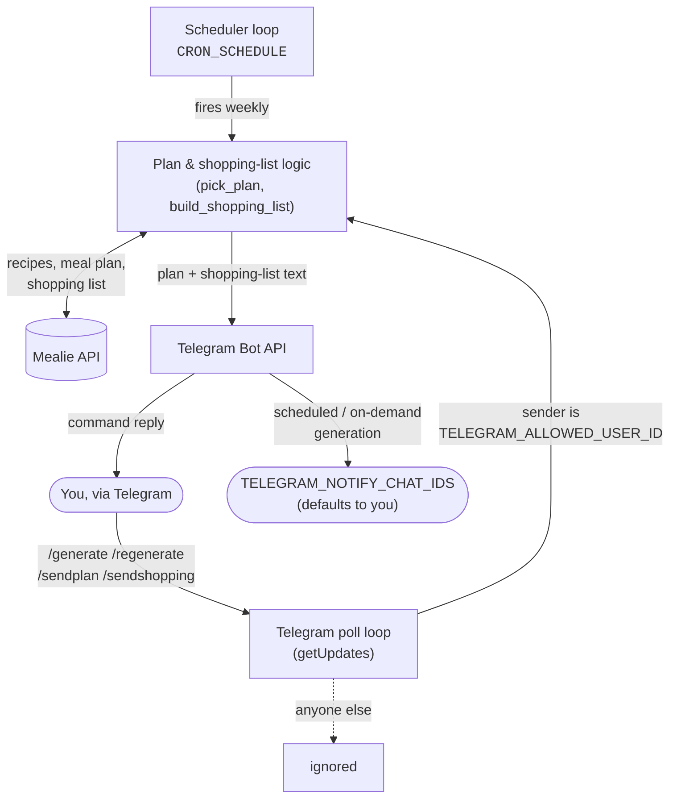

# mealie-lunch-planner

Generates a Monday–Sunday lunch plan in [Mealie](https://mealie.io) from
tagged recipe pools, builds a shopping list from it, and sends both over
Telegram. Runs as a single long-lived container: one loop fires on a cron
schedule, another long-polls Telegram for on-demand commands.

## Architecture



Both loops share the same plan/shopping-list logic and Mealie connection;
they differ only in what triggers them and where the output goes:

- **Scheduler loop** wakes up when `CRON_SCHEDULE` fires, generates next
  week's plan if one doesn't already exist, and **broadcasts** the result
  to every chat id in `TELEGRAM_NOTIFY_CHAT_IDS`.
- **Telegram poll loop** reacts to `/generate`, `/regenerate`, `/sendplan`
  and `/sendshopping` commands sent by `TELEGRAM_ALLOWED_USER_ID` (anyone
  else is ignored) and **replies** only in the chat that sent the command.

This must be a Telegram bot dedicated to this script — Telegram allows only
one `getUpdates` poller per bot token, so sharing a token with e.g. Home
Assistant's `telegram_bot` integration makes both flaky.

## How the plan is picked

Each weekday maps to one or more recipe-tag pools in Mealie (recipes must
also carry the `Μεσημεριανό` category to be eligible at all):

| Day | Pool |
|---|---|
| Monday | Όσπρια (legumes) |
| Tuesday | Κοτόπουλο (chicken) |
| Wednesday | Λαδερά |
| Thursday | Ζυμαρικά (pasta) |
| Friday | Χοιρινό **or** Μοσχάρι (pork or beef) |
| Saturday | Ψάρι **or** Θαλασσινά (fish or seafood) |
| Sunday | Cheat day |

A day with two candidate tags pulls from the union of both pools and picks
one recipe — not one from each. A recipe already used earlier that week is
excluded from later days.

## Week resolution

- The scheduler's target week always follows `CRON_SCHEDULE`: on the day(s)
  it's set to fire, "the target week" is the *upcoming* Monday–Sunday; on
  any other day (e.g. a startup sanity check, or a manual `--once` run)
  it's the *current* one, so an already-generated plan is found rather than
  skipped.
- The Telegram commands always target the week **after** the one containing
  today, regardless of what day you send them — `/generate` on Monday the
  21st targets the 28th–4th, not the 21st–27th.

## Telegram commands

| Command | Effect |
|---|---|
| `/generate` | Create next week's plan if one doesn't exist yet |
| `/regenerate confirm` | Discard the current plan and pick a new one (bare `/regenerate` asks for confirmation first) |
| `/sendplan` | Resend the day-by-day plan for the target week |
| `/sendshopping` | Resend the shopping list for the target week |

Register the command menu with **@BotFather** via `/setcommands`:

```
generate - Create next week's plan if one doesn't exist yet
regenerate - Discard the current plan and pick a new one (needs "confirm")
sendplan - Resend the day-by-day plan for the current target week
sendshopping - Resend the shopping list for the current target week
```

## Environment variables

| Variable | Required | Description |
|---|---|---|
| `MEALIE_URL` | yes | Base URL of your Mealie instance |
| `MEALIE_TOKEN` | yes | Mealie API token |
| `CRON_SCHEDULE` | no (default `0 18 * * 0`) | When the scheduler fires, standard 5-field cron syntax |
| `TELEGRAM_BOT_TOKEN` | yes | Token for a bot dedicated to this script |
| `TELEGRAM_ALLOWED_USER_ID` | yes | Your numeric Telegram user id — the only sender whose commands are accepted, and the default notification recipient |
| `TELEGRAM_NOTIFY_CHAT_IDS` | no | Comma-separated chat/user ids to notify on each generated plan (e.g. `111111,222222`). Defaults to just `TELEGRAM_ALLOWED_USER_ID` |

## Running it

```bash
cp env.example .env   # fill in the values above
docker compose up -d
```

`docker-compose.yml` uses `network_mode: host` to reach services on the
local network without extra port mapping. The container needs no inbound
ports of its own — Telegram updates are pulled via long-polling.
